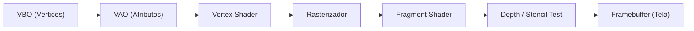

<script setup>
import ThreePanel from "./.vitepress/components/ThreePanel.vue";
import WebGLPanel from "./.vitepress/components/WebGLPanel.vue";
</script>

# OpenGL

> O **OpenGL** (Open Graphics Library) é a especificação de API gráfica mais influente e duradoura da história da computação. Criada originalmente pela Silicon Graphics Inc. (SGI) em 1992 e hoje mantida pelo Khronos Group, ela definiu os padrões de rasterização acelerada por hardware em computadores pessoais, servidores e dispositivos móveis (OpenGL ES).

No OpenGL clássico, a CPU comanda uma máquina de estados finitos na GPU: você cria buffers na memória gráfica, carrega dados de vértices, compila e liga shaders GLSL e submete chamadas de desenho (*draw calls*). No navegador, o equivalente direto é o **WebGL 2** (baseado em OpenGL ES 3.0).

---

## Demonstrações Interativas

### 1. WebGL 2 Nativo (Cubo MVP)
O painel abaixo executa WebGL 2 puro diretamente no canvas do navegador, sem nenhuma biblioteca externa — exatamente o mesmo padrão de código C++ com GLFW e GLSL utilizado em aplicações desktop.

<WebGLPanel
  title="Exemplo WebGL 2 Nativo"
  subtitle="Cubo 3D com Vertex Shader, Fragment Shader, VBO, VAO e matrizes de projeção Model-View-Projection (MVP)."
/>

### 2. O Pipeline Gráfico do OpenGL
A animação abaixo ilustra um pacote geométrico (triângulo) percorrendo os quatro grandes estágios clássicos da renderização: carregamento de buffer (VBO), transformação geométrica (Vertex Shader), recorte e conversão em pixels (Rasterizador) e cálculo de cor (Fragment Shader).

<ThreePanel
  topic="opengl"
  title="Estágios do Pipeline OpenGL"
  subtitle="VBO (Buffer) → Vertex Shader (VS) → Rasterização (Raster) → Fragment Shader (FS)."
/>

### 3. Texturização e Amostragem UV
O OpenGL mapeia coordenadas bidimensionais $(U, V)$ normalizadas entre $0.0$ e $1.0$ sobre a superfície dos polígonos através de unidades de textura dedicadas na GPU.

<ThreePanel
  topic="textura"
  title="Mapeamento de Textura UV"
  subtitle="Amostragem de textura com coordenadas UV dinâmicas aplicadas à geometria."
/>

### 4. Vetores Normais e Iluminação
Para calcular luz difusa e especular (como no modelo de iluminação Phong/Blinn-Phong clássico do OpenGL), a GPU precisa dos vetores normais perpendiculares a cada vértice.

<ThreePanel
  topic="normais"
  title="Vetores Normais de Superfície"
  subtitle="Setas direcionais indicando a normal de cada vértice utilizada no cálculo de iluminação por fragmento."
/>

---

## Como Funciona o Pipeline do OpenGL



### 1. Buffers de Vértices (VBO, VAO e EBO)
- **VBO (Vertex Buffer Object):** Memória alocada na VRAM da GPU para guardar arrays de números (posições $x,y,z$, normais, coordenadas UV, cores).
- **VAO (Vertex Array Object):** Objeto gerenciador que lembra quais ponteiros de atributos estão ligados a quais buffers.
- **EBO / IBO (Element Buffer Object):** Lista de índices que evita duplicação de vértices (ex: desenhar um quadrado com 4 vértices em vez de 6).

### 2. Shaders GLSL (OpenGL Shading Language)
Dois shaders são obrigatórios em qualquer programa OpenGL moderno:
- **Vertex Shader:** Executado uma vez para cada vértice. Recebe atributos, multiplica pela matriz MVP (`gl_Position = uMVP * vec4(aPos, 1.0);`) e passa dados interpolados para a frente.
- **Fragment Shader:** Executado uma vez para cada pixel coberto por um triângulo. Calcula a cor final (`FragColor = vec4(r, g, b, a);`).

---

## Exemplo Didático de Código OpenGL (C++ com GLFW e GLAD)

```cpp
#include <glad/glad.h>
#include <GLFW/glfw3.h>
#include <iostream>

// Código-fonte dos Shaders em GLSL 3.30
const char* vertexShaderSource = R"(
    #version 330 core
    layout (location = 0) in vec3 aPos;
    void main() {
        gl_Position = vec4(aPos, 1.0);
    }
)";

const char* fragmentShaderSource = R"(
    #version 330 core
    out vec4 FragColor;
    void main() {
        FragColor = vec4(0.22f, 0.74f, 0.97f, 1.0f); // Azul ciano
    }
)";

int main() {
    glfwInit();
    glfwWindowHint(GLFW_CONTEXT_VERSION_MAJOR, 3);
    glfwWindowHint(GLFW_CONTEXT_VERSION_MINOR, 3);
    glfwWindowHint(GLFW_OPENGL_PROFILE, GLFW_OPENGL_CORE_PROFILE);

    GLFWwindow* window = glfwCreateWindow(800, 600, "Render Index - OpenGL Window", NULL, NULL);
    glfwMakeContextCurrent(window);
    gladLoadGLLoader((GLADloadproc)glfwGetProcAddress);

    // Compilação dos Shaders
    unsigned int vs = glCreateShader(GL_VERTEX_SHADER);
    glShaderSource(vs, 1, &vertexShaderSource, NULL);
    glCompileShader(vs);

    unsigned int fs = glCreateShader(GL_FRAGMENT_SHADER);
    glShaderSource(fs, 1, &fragmentShaderSource, NULL);
    glCompileShader(fs);

    unsigned int shaderProgram = glCreateProgram();
    glAttachShader(shaderProgram, vs);
    glAttachShader(shaderProgram, fs);
    glLinkProgram(shaderProgram);

    // Coordenadas de um Triângulo
    float vertices[] = {
        -0.5f, -0.5f, 0.0f,
         0.5f, -0.5f, 0.0f,
         0.0f,  0.5f, 0.0f
    };

    unsigned int VAO, VBO;
    glGenVertexArrays(1, &VAO);
    glGenBuffers(1, &VBO);

    glBindVertexArray(VAO);
    glBindBuffer(GL_ARRAY_BUFFER, VBO);
    glBufferData(GL_ARRAY_BUFFER, sizeof(vertices), vertices, GL_STATIC_DRAW);

    glVertexAttribPointer(0, 3, GL_FLOAT, GL_FALSE, 3 * sizeof(float), (void*)0);
    glEnableVertexAttribArray(0);

    // Loop de Renderização
    while (!glfwWindowShouldClose(window)) {
        glClearColor(0.04f, 0.07f, 0.12f, 1.0f);
        glClear(GL_COLOR_BUFFER_BIT);

        glUseProgram(shaderProgram);
        glBindVertexArray(VAO);
        glDrawArrays(GL_TRIANGLES, 0, 3);

        glfwSwapBuffers(window);
        glfwPollEvents();
    }

    glfwTerminate();
    return 0;
}
```

---

## Links Rápidos

- [LearnOpenGL](https://learnopengl.com/) — o melhor e mais conceituado tutorial de OpenGL do mundo
- [Khronos OpenGL Registry](https://registry.khronos.org/OpenGL/) — especificações oficiais de todas as versões do OpenGL e extensões
- [OpenGL Wiki Oficial](https://www.khronos.org/opengl/wiki/) — referência técnica enciclopédica
- [GLFW](https://www.glfw.org/) — biblioteca padrão para criação de janelas, contexto OpenGL e inputs
- [GLM (OpenGL Mathematics)](https://github.com/g-truc/glm) — biblioteca de cabeçalho único para vetores e matrizes
- [WebGL Fundamentals](https://webglfundamentals.org/) — aprenda o pipeline WebGL a fundo

---

## 🚀 MEGA LINK DUMP - OpenGL Ecosystem

### 📖 Tutoriais, Cursos e Livros
- [LearnOpenGL (Joey de Vries)](https://learnopengl.com/) — / [GitHub do Livro](https://github.com/JoeyDeVries/LearnOpenGL) / [Começando](https://learnopengl.com/Getting-started/Hello-Window) / [Iluminação](https://learnopengl.com/Lighting/Basic-Lighting) / [Model Loading](https://learnopengl.com/Model-Loading/Assimp) / [Advanced OpenGL](https://learnopengl.com/Advanced-OpenGL/Depth-testing) / [PBR](https://learnopengl.com/PBR/Theory)
- [Open.GL (Alexander Overvoorde)](https://open.gl/) — introdução concisa e direta ao OpenGL moderno — / [Tutorial](https://open.gl/) / [Contextos](https://open.gl/context) / [Buffers](https://open.gl/drawing) / [Shaders](https://open.gl/shaders)
- [OGLDev: Modern OpenGL Tutorials (Etay Meiri)](https://ogldev.org/) — dezenas de tutoriais cobrindo técnicas de AAA games — / [Website](https://ogldev.org/) / [Shadow Mapping](https://ogldev.org/www/tutorial24/tutorial24.html) / [Skeletal Animation](https://ogldev.org/www/tutorial38/tutorial38.html)
- [The Cherno - OpenGL C++ Playlist](https://www.youtube.com/playlist?list=PLlrATfBNZ98foTJPJ_Ev03o2oq3-GGOS2) — excelente série em vídeo passo a passo em C++ — / [YouTube Playlist](https://www.youtube.com/playlist?list=PLlrATfBNZ98foTJPJ_Ev03o2oq3-GGOS2)
- [OpenGL SuperBible (7ª Edição)](https://www.openglsuperbible.com/) — / [Website Oficial](https://www.openglsuperbible.com/) / [Código Fonte GitHub](https://github.com/openglsuperbible/sb7code)
- [Computer Graphics: Principles and Practice](https://cgpp.net/) — / [Website](https://cgpp.net/) / [Exemplos de Código](https://github.com/foolmoron/cgpp)

### 🛠️ Bibliotecas Essenciais em C/C++
- [GLFW](https://www.glfw.org/) — gerenciamento de janelas multiplataforma e contexto OpenGL — / [Download](https://www.glfw.org/download.html) / [Documentação](https://www.glfw.org/docs/latest/) / [GitHub](https://github.com/glfw/glfw)
- [GLAD](https://glad.dav1d.de/) — gerador de carregadores de funções de extensões OpenGL e Vulkan — / [Gerador Web](https://glad.dav1d.de/) / [GitHub](https://github.com/Dav1dde/glad)
- [GLEW](https://glew.sourceforge.net/) — The OpenGL Extension Wrangler Library (clássico) — / [Website](https://glew.sourceforge.net/) / [GitHub](https://github.com/nigels-com/glew)
- [GLM](https://github.com/g-truc/glm) — matemática gráfica baseada na especificação do GLSL — / [GitHub](https://github.com/g-truc/glm) / [Manual](https://github.com/g-truc/glm/blob/master/manual.md)
- [stb_image](https://github.com/nothings/stb) — decodificador leve de imagens (PNG, JPEG, etc.) em arquivo único de cabeçalho C — / [GitHub](https://github.com/nothings/stb)
- [Assimp (Open Asset Import Library)](https://www.assimp.org/) — importador universal de mais de 40 formatos 3D (FBX, OBJ, glTF, Collada) — / [Website](https://www.assimp.org/) / [GitHub](https://github.com/assimp/assimp)
- [Dear ImGui](https://github.com/ocornut/imgui) — biblioteca GUI imediata para criação de interfaces de depuração em OpenGL — / [GitHub](https://github.com/ocornut/imgui) / [Demonstração WebAssembly](https://pthom.github.io/imgui_manual_online/manual/imgui_manual.html)

### 💻 Ferramentas de Depuração e Inspeção
- [RenderDoc](https://renderdoc.org/) — captura e análise quadro a quadro de chamadas de desenho, buffers e texturas — / [Website](https://renderdoc.org/) / [GitHub](https://github.com/baldurk/renderdoc)
- [NVIDIA Nsight Graphics](https://developer.nvidia.com/nsight-graphics) — ferramenta de profiling avançado para GPUs NVIDIA — / [Portal](https://developer.nvidia.com/nsight-graphics)
- [GLIntercept](https://github.com/dtrebilco/glintercept) — interceptador de chamadas OpenGL para depuração em tempo de execução — / [GitHub](https://github.com/dtrebilco/glintercept)

### 🌐 Comunidades e Fóruns
- [Fórum Oficial Khronos OpenGL](https://community.khronos.org/c/opengl/2) — discussões oficiais sobre especificações e bugs
- [Reddit r/opengl](https://www.reddit.com/r/opengl/) — comunidade ativa de desenvolvedores compartilhando projetos e dúvidas
- [Stack Overflow OpenGL Tag](https://stackoverflow.com/questions/tagged/opengl) — mais de 60.000 perguntas e respostas técnicas
