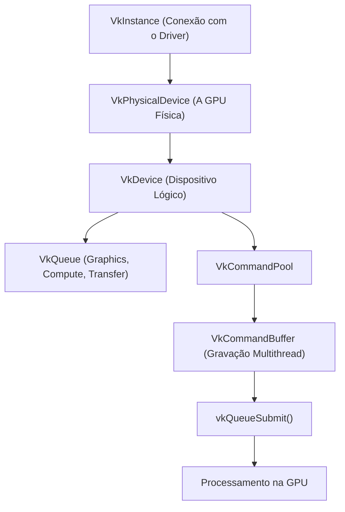

<script setup>
import ThreePanel from "./.vitepress/components/ThreePanel.vue";
import WebGPUPanel from "./.vitepress/components/WebGPUPanel.vue";
</script>

# Vulkan

> O **Vulkan** é a API gráfica e de computação de baixo nível de nova geração do Khronos Group. Projetado do zero a partir da base do AMD Mantle, ele substitui as premissas antigas do OpenGL por um modelo **explícito e orientado a multithreading**, permitindo que os desenvolvedores controlem diretamente a alocação de VRAM, estados de pipeline pré-compilados e submissões paralelas em múltiplas filas da GPU.

Diferente do OpenGL, onde o driver da placa de vídeo precisava adivinhar intenções e realizar validações caras em tempo real, no Vulkan **o driver é extremamente fino**: toda a responsabilidade de sincronização, barreiras de memória e gravação de comandos recai sobre a aplicação.

---

## Demonstrações Interativas

### 1. Filas de Comandos Assíncronas e Paralelismo
O Vulkan divide o trabalho em filas independentes (Graphics, Compute e Transfer). A animação abaixo ilustra três vias (*lanes*) de comandos sendo despachadas em paralelo a partir de múltiplas threads da CPU para a GPU.

<ThreePanel
  topic="vulkan"
  title="Filas e Command Buffers Paralelos"
  subtitle="Blocos de comandos enviados em ritmos diferentes através de instancing até a GPU."
/>

### 2. Pipeline State Objects (PSO) Pré-compilados
No Vulkan, nada de compilar shaders ou mudar estados no meio da renderização. Todo o pipeline (shaders, blend modes, depth testing, rasterizer) é compilado antecipadamente como um objeto imutável.

<ThreePanel
  topic="pipeline"
  title="Fluxo de Execução de Pipeline"
  subtitle="Passes de renderização ordenados e orquestrados sem custo de validação em tempo de execução."
/>

### 3. Computação Geral e Sistemas de Partículas (GPGPU)
Com suporte de primeira classe a **Compute Shaders**, o Vulkan processa milhões de partículas ou simulações físicas pesadas sem tocar na CPU.

<ThreePanel
  topic="particulas"
  title="Compute e Simulação de Partículas"
  subtitle="Vorticidade e cinemática calculadas em paralelo na GPU."
/>

### 4. WebGPU: O Vulkan do Navegador
O Vulkan não roda diretamente dentro de páginas web por razões de segurança e portabilidade; no entanto, o **WebGPU** é seu herdeiro direto na web, adotando os mesmos conceitos de Adapter, Device, Queue, CommandEncoder e pipelines pré-compilados com shaders em WGSL.

<WebGPUPanel
  title="WebGPU Nativo — O Parente Web do Vulkan"
  subtitle="Render pipeline explícito, bind groups e fila de comandos em WGSL. Requer Chrome, Edge ou Firefox recente."
/>

---

## Os Pilares da Arquitetura Vulkan



### 1. Gravação de Comandos sem Bloqueio (Multithreading)
No OpenGL, apenas uma thread podia interagir com o contexto por vez. No Vulkan, cada núcleo da CPU pode ter seu próprio `VkCommandPool` e gravar milhares de chamadas de desenho em `VkCommandBuffer` simultaneamente, submetendo tudo de uma vez à GPU via `vkQueueSubmit`.

### 2. SPIR-V: Compilação Antecipada de Shaders
Em vez de enviar texto cru em GLSL para o driver compilar durante o jogo (causando travamentos ou *stuttering*), os shaders Vulkan são pré-compilados no computador do desenvolvedor para o bytecode binário **SPIR-V**. A GPU apenas traduz o bytecode para suas instruções nativas instantaneamente.

### 3. Sincronização Explícita
A aplicação define exatamente quando um recurso pode ser lido ou modificado usando:
- **Fences:** Sincronizam a GPU com a CPU (saber quando a GPU terminou um frame).
- **Semaphores:** Sincronizam filas internas na GPU (ex: esperar a imagem da swapchain estar pronta antes de renderizar).
- **Pipeline Barriers:** Controlam transições de layout de imagens (ex: mudar de `VK_IMAGE_LAYOUT_TRANSFER_DST_OPTIMAL` para `VK_IMAGE_LAYOUT_SHADER_READ_ONLY_OPTIMAL`).

---

## Estrutura Básica de Inicialização (C++ com Vulkan SDK)

```cpp
#include <vulkan/vulkan.h>
#include <iostream>
#include <vector>

int main() {
    // 1. Criação da Instância Vulkan
    VkApplicationInfo appInfo{};
    appInfo.sType = VK_STRUCTURE_TYPE_APPLICATION_INFO;
    appInfo.pApplicationName = "Render Index - Vulkan Engine";
    appInfo.applicationVersion = VK_MAKE_VERSION(1, 0, 0);
    appInfo.apiVersion = VK_API_VERSION_1_3;

    VkInstanceCreateInfo createInfo{};
    createInfo.sType = VK_STRUCTURE_TYPE_INSTANCE_CREATE_INFO;
    createInfo.pApplicationInfo = &appInfo;

    VkInstance instance;
    if (vkCreateInstance(&createInfo, nullptr, &instance) != VK_SUCCESS) {
        std::cerr << "Falha ao criar instância Vulkan!" << std::endl;
        return -1;
    }

    // 2. Encontrar GPU compatível
    uint32_t deviceCount = 0;
    vkEnumeratePhysicalDevices(instance, &deviceCount, nullptr);
    std::vector<VkPhysicalDevice> devices(deviceCount);
    vkEnumeratePhysicalDevices(instance, &deviceCount, devices.data());

    VkPhysicalDevice physicalDevice = devices[0];
    VkPhysicalDeviceProperties props;
    vkGetPhysicalDeviceProperties(physicalDevice, &props);
    std::cout << "GPU Encontrada: " << props.deviceName << std::endl;

    // 3. Finalização
    vkDestroyInstance(instance, nullptr);
    return 0;
}
```

---

## Links Rápidos

- [Vulkan Tutorial (Alexander Overvoorde)](https://vulkan-tutorial.com/) — o melhor guia passo a passo para iniciantes
- [VkGuide (Victor Blanco)](https://vkguide.dev/) — tutorial moderno ensinando Vulkan 1.3 com técnicas de ponta
- [Khronos Vulkan Registry](https://registry.khronos.org/vulkan/) — especificações oficiais completas e extensões KHR
- [Vulkan-Samples (Khronos)](https://github.com/KhronosGroup/Vulkan-Samples) — repositório oficial de melhores práticas e otimização
- [LunarG Vulkan SDK](https://vulkan.lunarg.com/) — ferramentas de desenvolvimento, camadas de validação e headers oficiais

---

## 🚀 MEGA LINK DUMP - Vulkan Ecosystem

### 📖 Tutoriais, Livros e Guias Completos
- [Vulkan Tutorial](https://vulkan-tutorial.com/) — / [GitHub](https://github.com/Overv/VulkanTutorial) / [Setup do Ambiente](https://vulkan-tutorial.com/Development_environment) / [Pipeline Gráfico](https://vulkan-tutorial.com/Drawing_a_triangle/Graphics_pipeline_basics) / [Swapchain e Buffers](https://vulkan-tutorial.com/Drawing_a_triangle/Presentation) / [Compute Shaders](https://vulkan-tutorial.com/Compute_Shader)
- [VkGuide.dev](https://vkguide.dev/) — tutorial focado em Vulkan 1.3 moderno sem boilerplate desnecessário — / [Website](https://vkguide.dev/) / [GitHub](https://github.com/vblanco20-1/vulkan-guide) / [Capítulo: Desenho Rápido](https://vkguide.dev/docs/new_chapter_1/)
- [Khronos Vulkan Guide](https://github.com/KhronosGroup/Vulkan-Guide) — guia oficial mantido pelo comitê do Vulkan — / [GitHub](https://github.com/KhronosGroup/Vulkan-Guide) / [Capítulos](https://github.com/KhronosGroup/Vulkan-Guide/tree/main/chapters)
- [Awesome Vulkan (Vincent Noel)](https://github.com/vinjn/awesome-vulkan) — lista gigante curada com bibliotecas, motores, samples e artigos — / [GitHub](https://github.com/vinjn/awesome-vulkan)
- [Sascha Willems Vulkan Examples](https://github.com/SaschaWillems/Vulkan) — a maior coleção de exemplos práticos em C++ do mundo (Ray Tracing, Tessellation, PBR, Compute) — / [GitHub](https://github.com/SaschaWillems/Vulkan) / [Website](https://saschawillems.de/)
- [Vulkan Programming Guide (The Red Book)](https://www.amazon.com/Vulkan-Programming-Guide-Official-Guide/dp/0134464540) — guia clássico com a arquitetura interna detalhada

### 🛠️ Bibliotecas de Suporte e SDKs
- [LunarG Vulkan SDK](https://vulkan.lunarg.com/) — inclui as Validation Layers, compilador glslang e SPIRV-Tools — / [Download](https://vulkan.lunarg.com/sdk/home) / [Documentação](https://vulkan.lunarg.com/doc/sdk/latest/windows/documentation.html)
- [Vulkan-Hpp](https://github.com/KhronosGroup/Vulkan-Hpp) — bindings C++ modernos com tipagem estática, enums com classes e suporte a exceptions — / [GitHub](https://github.com/KhronosGroup/Vulkan-Hpp)
- [Vulkan Memory Allocator (VMA - AMD)](https://github.com/GPUOpen-LibrariesAndSDKs/VulkanMemoryAllocator) — biblioteca padrão da indústria para alocação inteligente de VRAM sem fragmentação — / [GitHub](https://github.com/GPUOpen-LibrariesAndSDKs/VulkanMemoryAllocator) / [Documentação](https://gpuopen-librariesandsdks.github.io/VulkanMemoryAllocator/html/)
- [vk-bootstrap](https://github.com/charles-lunarg/vk-bootstrap) — utilitário C++ para eliminar mais de 1000 linhas de código boilerplate na criação de Instância e Dispositivo — / [GitHub](https://github.com/charles-lunarg/vk-bootstrap)
- [MoltenVK](https://github.com/KhronosGroup/MoltenVK) — camada de compatibilidade oficial que converte chamadas Vulkan para Apple Metal no macOS e iOS — / [GitHub](https://github.com/KhronosGroup/MoltenVK)
- [SPIRV-Tools](https://github.com/KhronosGroup/SPIRV-Tools) — montador, desmontador e otimizador de shaders binários SPIR-V — / [GitHub](https://github.com/KhronosGroup/SPIRV-Tools)

### 🔬 Ferramentas de Inspeção e Otimização
- [RenderDoc](https://renderdoc.org/) — depuração visual completa de passes Vulkan, inspect de memória e command buffers — / [Website](https://renderdoc.org/) / [GitHub](https://github.com/baldurk/renderdoc)
- [NVIDIA Nsight Systems & Graphics](https://developer.nvidia.com/nsight-tools) — análise profunda de gargalos de CPU/GPU e sincronização — / [Portal](https://developer.nvidia.com/nsight-tools)
- [Radeon GPU Profiler (RGP - AMD)](https://gpuopen.com/rgp/) — profiler de baixo nível para GPUs AMD Radeon — / [Website](https://gpuopen.com/rgp/) / [GitHub](https://github.com/GPUOpen-Tools/Radeon-GPU-Profiler)

### 👥 Comunidades e Fóruns
- [Fórum Khronos Vulkan](https://community.khronos.org/c/vulkan/30) — discussões técnicas oficiais
- [Reddit r/vulkan](https://www.reddit.com/r/vulkan/) — notícias, projetos autorais e dúvidas
- [Vulkan Discord](https://discord.gg/vulkan) — canal com engenheiros da Khronos, NVIDIA, AMD e desenvolvedores de engines
