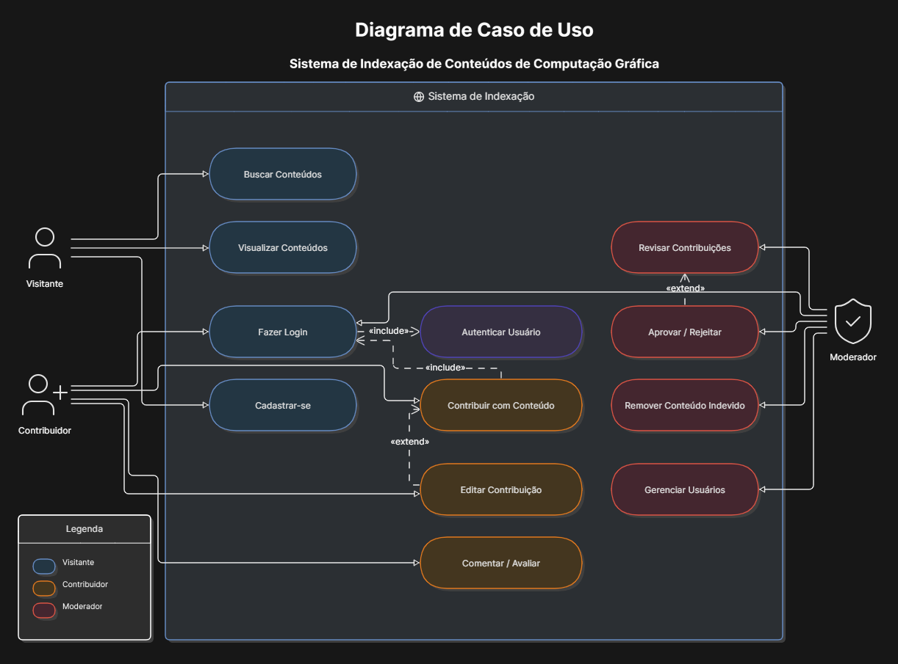
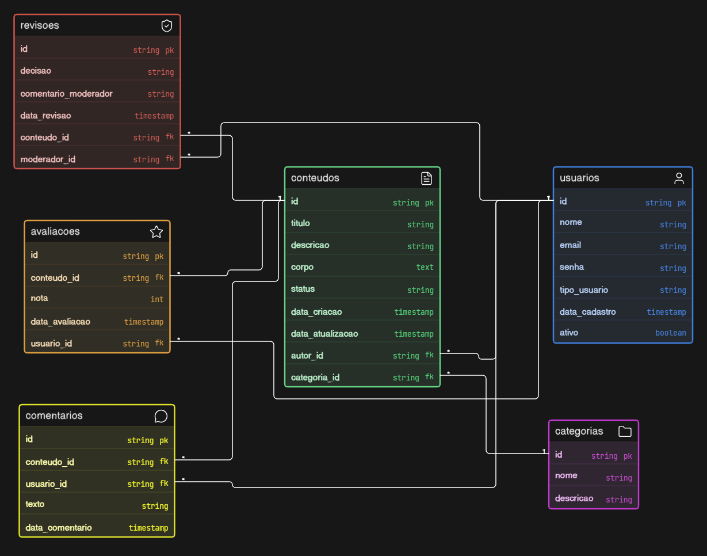



<strong>Etec Vasco Antonio Venchiarutti</strong>    
Técnico em Desenvolvimento de Sistemas  
Jun 2026  

  
    
# LINGUAGEM DE MODELAGEM UML:  
## DIAGRAMA DE CASO DE USO E DIAGRAMA DE CLASSES  
 
  

  
Fernando dos Santos Braz   
Gustavo Henrique da Silva Alves   
Gustavo Müller Santos  

# UML

## Conceito

A UML (Unified Modeling Language), ou Linguagem de Modelagem Unificada, é uma linguagem visual utilizada para modelar sistemas de software. Ela permite representar graficamente diferentes aspectos de um sistema antes de sua implementação, facilitando o entendimento entre desenvolvedores, analistas, clientes e demais envolvidos no projeto.

Embora seja chamada de linguagem, a UML não é uma linguagem de programação. Ela serve apenas para documentar, analisar e planejar sistemas.

## Objetivo

Os principais objetivos da UML são:

- Facilitar a comunicação entre todos os participantes do projeto;
- Planejar a estrutura de um sistema antes da programação;
- Documentar o funcionamento do software;
- Reduzir erros durante o desenvolvimento;
- Auxiliar na manutenção e evolução dos sistemas.

## História

A UML surgiu durante a década de 1990, quando três importantes especialistas em engenharia de software — Grady Booch, James Rumbaugh e Ivar Jacobson — unificaram seus métodos de modelagem.

Em 1997, a UML foi oficialmente adotada pela Object Management Group (OMG), tornando-se um padrão internacional para modelagem de sistemas orientados a objetos.

Desde então, ela continua sendo utilizada em projetos de software no mundo todo.

## Onde é utilizada

A UML é utilizada em diversos tipos de projetos, como:

- Sistemas bancários;
- Sistemas escolares;
- Sistemas hospitalares;
- Aplicativos para celulares;
- Jogos digitais;
- Sistemas empresariais;
- Comércio eletrônico;
- Sistemas governamentais.

---

# Diagrama de Caso de Uso

## Finalidade

O Diagrama de Caso de Uso representa as funcionalidades oferecidas por um sistema e mostra como os usuários interagem com elas.

Seu principal objetivo é apresentar o sistema de maneira simples, permitindo compreender seus requisitos sem entrar em detalhes técnicos.

## Principais elementos

Os principais elementos são:

- Atores;
- Casos de uso;
- Sistema;
- Relacionamentos.

## Atores

Os atores representam quem utiliza o sistema.

Podem ser pessoas, empresas ou até outros sistemas.

Exemplos:

- Cliente;
- Funcionário;
- Administrador;
- Professor;
- Aluno.

## Casos de Uso

Os casos de uso representam as funcionalidades do sistema.

Exemplos:

- Fazer login;
- Cadastrar usuário;
- Realizar pagamento;
- Emitir relatório;
- Consultar produtos.

## Relacionamentos

Os principais relacionamentos são:

- Associação: liga um ator a uma funcionalidade.
- Include («include»): quando um caso de uso sempre depende de outro.
- Extend («extend»): adiciona uma funcionalidade opcional.
- Generalização: representa herança entre atores ou casos de uso.

## Exemplo

No exemplo a seguir é representado o diagrama do nosso projeto em relação as contribuições feitas por usuários.

Figura 1: Diagrama de Caso de Uso   
 
Fonte: Elaborado pelos autores  

---

# Diagrama de Classes

## Finalidade

O Diagrama de Classes representa a estrutura interna do sistema.

Ele mostra quais classes existirão, seus atributos, métodos e os relacionamentos entre elas.

É considerado um dos diagramas mais importantes da UML.

## Classes

As classes representam os objetos existentes no sistema.

Exemplos:

- Cliente
- Produto
- Pedido
- Livro
- Funcionário

## Atributos

Os atributos representam as características das classes.

Exemplo da classe Livro:

- título
- autor
- ISBN
- quantidade

## Métodos

Os métodos representam as ações que um objeto pode executar.

Exemplos:

- emprestar()
- devolver()
- cadastrar()
- excluir()
- calcularTotal()

## Relacionamentos entre Classes

Os principais relacionamentos são:

- Associação;
- Agregação;
- Composição;
- Generalização (Herança);
- Dependência.

## Exemplo

No exemplo a seguir é representado a estrutura do sistema do nosso projeto. 

Figura 2: Diagrama de Classe   
 
Fonte: Elaborado pelos autores  

---

# Comparação entre os Diagramas

| Diagrama de Caso de Uso | Diagrama de Classes |
|--------------------------|---------------------|
| Mostra as funcionalidades do sistema | Mostra a estrutura do sistema |
| Focado no usuário | Focado na implementação |
| Representa atores e casos de uso | Representa classes, atributos e métodos |
| Utilizado no levantamento de requisitos | Utilizado no projeto do software |

O Diagrama de Caso de Uso é utilizado nas fases iniciais do desenvolvimento, durante o levantamento e análise dos requisitos.

O Diagrama de Classes é utilizado durante o projeto do sistema, servindo como base para a programação.

---

# Aplicação Prática

## Biblioteca

### Atores

- Aluno
- Bibliotecário
- Administrador

### Funcionalidades

- Fazer login;
- Pesquisar livros;
- Emprestar livros;
- Renovar empréstimos;
- Devolver livros;
- Cadastrar livros;
- Atualizar cadastro;
- Emitir relatórios.

### Classes

- Livro
- Aluno
- Bibliotecário
- Empréstimo
- Usuário
- Autor
- Categoria

Cada uma dessas classes possui atributos próprios e métodos responsáveis pelo funcionamento do sistema.

---

# Conclusão

A UML é uma ferramenta extremamente importante para o desenvolvimento de software, pois permite organizar as ideias antes da programação, reduzindo erros e melhorando a comunicação entre todos os envolvidos no projeto. 

> 
Existem limites para a capacidade humana de compreender complexidades. Com a ajuda da modelagem, delimitamos o problema que estamos estudando, restringindo nosso foco a um único aspecto por vez. Em essência esse é o procedimento de “dividir-e-conquistar”, do qual Edsger Dijkstra falava há anos: ataque um problema difícil, dividindo-o em vários problemas menores que você pode solucionar. Além disso, com o auxílio da modelagem, somos capazes de ampliar o intelecto humano. Um modelo escolhido de maneira adequada permitirá a quem usa a modelagem trabalhar em níveis mais altos de abstração.

Durante esta pesquisa foi possível compreender que os Diagramas de Caso de Uso ajudam a identificar as funcionalidades e a interação dos usuários com o sistema, enquanto os Diagramas de Classes representam sua estrutura interna. Ambos trabalham de forma complementar, tornando o desenvolvimento mais organizado, eficiente e fácil de manter. O estudo também mostrou que a UML continua sendo uma das principais ferramentas utilizadas na Engenharia de Software.

---

# Referências

BOOCH, Grady; RUMBAUGH, James; JACOBSON, Ivar. *UML: Guia do Usuário*. 2. ed. Rio de Janeiro: Elsevier, 2012.

OBJECT MANAGEMENT GROUP (OMG). _OMG Unified Modeling Language (OMG UML)_. Disponível em: [https://www.omg.org/spec/UML/](https://www.omg.org/spec/UML/). Acesso em: 30 jun. 2026.

SPARX SYSTEMS. _Unified Modeling Language (UML)_. Disponível em: [https://sparxsystems.com/resources/tutorials/uml2/](https://sparxsystems.com/resources/tutorials/uml2/). Acesso em: 1 jul. 2026.

VISUAL PARADIGM. _What is UML?_. Disponível em: [https://www.visual-paradigm.com/guide/uml-unified-modeling-language/what-is-uml/](https://www.visual-paradigm.com/guide/uml-unified-modeling-language/what-is-uml/). Acesso em: 1 jul. 2026.
